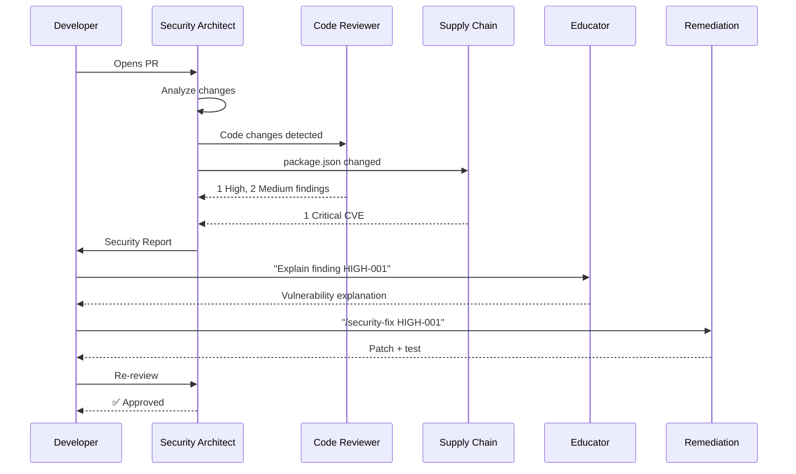
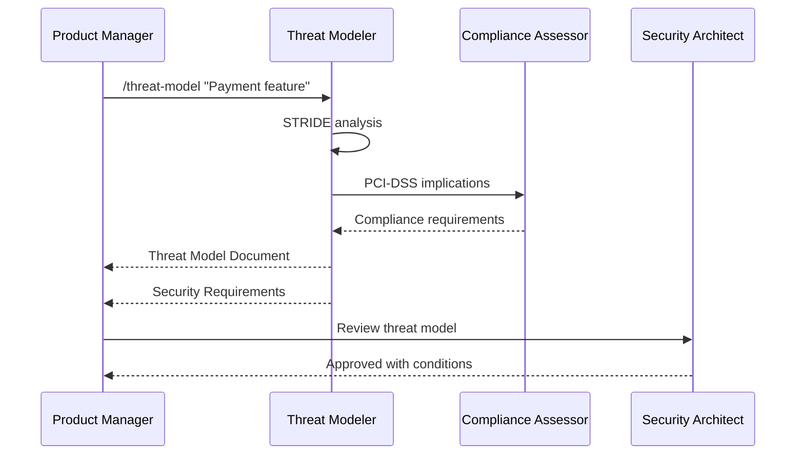
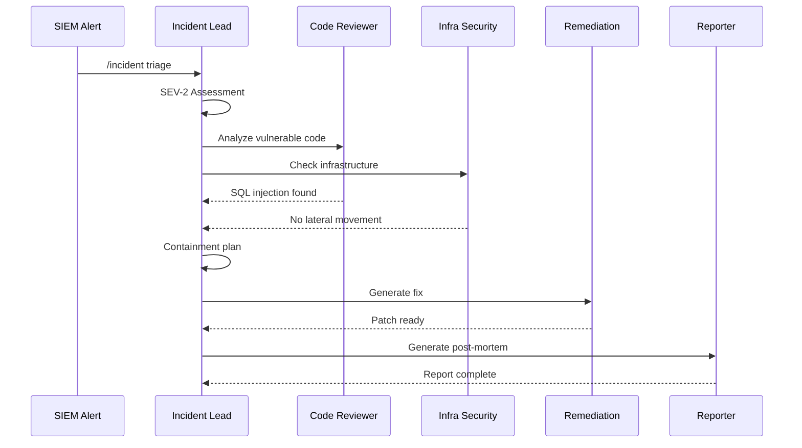

# Security Agent Family Guide

> [Doctrine](../../README.md) > [AI](./README.md) > Security Agents

The key words "MUST", "MUST NOT", "REQUIRED", "SHALL", "SHALL NOT", "SHOULD",
"SHOULD NOT", "RECOMMENDED", "MAY", and "OPTIONAL" in this document are to be
interpreted as described in [RFC 2119](https://datatracker.ietf.org/doc/html/rfc2119).

## Quick Reference

| Command | Agent | Model | Use Case |
|---------|-------|-------|----------|
| `/security` | Security Architect | Opus | Full security assessment |
| `/security quick` | Code Security Reviewer | Haiku | Fast code scan |
| `/security code` | Code Security Reviewer | Sonnet | Deep code analysis |
| `/security deps` | Supply Chain Auditor | Haiku+ | Dependency + SLSA audit |
| `/security infra` | Infrastructure Security | Sonnet | IaC, cloud, containers |
| `/security threat` | Threat Modeler | Sonnet | Design-time analysis |
| `/security network` | Network Security Analyst | Sonnet | Zero trust, segmentation |
| `/security detect` | Detection Engineering | Sonnet | Fingerprinting, hunting |
| `/security emerging` | Emerging Tech Security | Sonnet | AI/ML, quantum, TEEs |
| `/security redteam` | Red Team Operator | Opus | Attack path analysis |
| `/security siem` | SIEM/SOAR Integration | Sonnet | Detection rules, playbooks |
| `/security compliance` | Compliance Assessor | Sonnet | Regulatory compliance |
| `/incident` | Incident Response Lead | Opus | Security events |
| `/security posture` | Security Posture Score | Sonnet | Quantified security metrics |
| `/security-fix` | Remediation Generator | Sonnet | Generate fixes |

## Overview

The Doctrine Security Agent Family is a coordinated set of specialized AI
agents for comprehensive security analysis. Unlike monolithic security tools,
this family provides:

1. **Lifecycle Coverage** - From design to incident response
2. **Cost Optimization** - Right model for each task (80% cost savings vs. all-Opus)
3. **Deep Specialization** - Each agent is an expert in its domain
4. **Educational Focus** - Teaches developers, not just flags issues
5. **Standards-Based** - RFC 2119 severities, OWASP/CWE mappings

## Architecture

```text
┌─────────────────────────────────────────────────────────────────────────────┐
│                     DOCTRINE SECURITY AGENT FAMILY                          │
├─────────────────────────────────────────────────────────────────────────────┤
│                                                                              │
│                      ┌────────────────────────────┐                         │
│                      │    SECURITY ARCHITECT      │                         │
│                      │    (Opus - Coordinator)    │                         │
│                      └─────────────┬──────────────┘                         │
│                                    │                                         │
│  ┌──────────┬──────────┬──────────┼──────────┬──────────┬──────────┐       │
│  ▼          ▼          ▼          ▼          ▼          ▼          ▼       │
│ ┌────────┐ ┌────────┐ ┌────────┐ ┌────────┐ ┌────────┐ ┌────────┐ ┌──────┐│
│ │ CODE   │ │SUPPLY  │ │ INFRA  │ │THREAT  │ │NETWORK │ │COMPLI- │ │INCID-││
│ │REVIEWER│ │ CHAIN  │ │SECURITY│ │MODELER │ │SECURITY│ │ ANCE   │ │ ENT  ││
│ │(Sonnet)│ │(Haiku+)│ │(Sonnet)│ │(Sonnet)│ │(Sonnet)│ │(Sonnet)│ │(Opus)││
│ └────────┘ └────────┘ └────────┘ └────────┘ └────────┘ └────────┘ └──────┘│
│                                                                              │
│ ┌────────────────────────────────────────────────────────────────────────┐  │
│ │                     SPECIALIZED DOMAIN AGENTS                          │  │
│ │  ┌──────────────┐  ┌──────────────┐  ┌──────────────┐  ┌────────────┐ │  │
│ │  │  DETECTION   │  │  EMERGING    │  │  RED TEAM    │  │ SIEM/SOAR  │ │  │
│ │  │ ENGINEERING  │  │    TECH      │  │  OPERATOR    │  │INTEGRATION │ │  │
│ │  │  (Sonnet)    │  │  (Sonnet)    │  │   (Opus)     │  │  (Sonnet)  │ │  │
│ │  │ JA4+, Hunt   │  │ AI/ML, PQC   │  │ ATT&CK Sim   │  │ Rules, SOC │ │  │
│ │  └──────────────┘  └──────────────┘  └──────────────┘  └────────────┘ │  │
│ └────────────────────────────────────────────────────────────────────────┘  │
│                                                                              │
│ ┌────────────────────────────────────────────────────────────────────────┐  │
│ │                        SUPPORTING AGENTS                               │  │
│ │  ┌──────────────┐  ┌──────────────┐  ┌──────────────┐  ┌────────────┐│  │
│ │  │  SECURITY    │  │ REMEDIATION  │  │  SECURITY    │  │  POSTURE   ││  │
│ │  │  EDUCATOR    │  │  GENERATOR   │  │  REPORTER    │  │   SCORE    ││  │
│ │  │  (Haiku)     │  │  (Sonnet)    │  │  (Haiku)     │  │  (Sonnet)  ││  │
│ │  └──────────────┘  └──────────────┘  └──────────────┘  └────────────┘│  │
│ └────────────────────────────────────────────────────────────────────────┘  │
└─────────────────────────────────────────────────────────────────────────────┘
```

## Agent Specifications

### Tier 1: Strategic Coordinator

#### Security Architect

The **Security Architect** is the strategic coordinator for all security efforts.

| Attribute | Value |
|-----------|-------|
| **Model** | Opus 4.5 |
| **Command** | `/security` |
| **Invocation** | On PR, manual, or triggered by security-sensitive paths |

**Responsibilities**:

- Assess overall security posture
- Route to appropriate specialists
- Synthesize findings across domains
- Provide prioritized remediation roadmap

**When to Use**:

- Comprehensive security review
- Cross-domain security assessment
- Executive-level security reporting

### Tier 2: Domain Specialists

#### Threat Modeler

Analyzes system designs BEFORE implementation.

| Attribute | Value |
|-----------|-------|
| **Model** | Sonnet 4.5 |
| **Command** | `/threat-model` |
| **Methodology** | STRIDE, Attack Trees, Data Flow Diagrams |

**Output**:

- Data flow diagrams (Mermaid)
- STRIDE analysis per trust boundary
- Attack trees for critical assets
- Security requirements (RFC 2119)
- Risk assessment matrix

**When to Use**:

- New feature design
- Architecture changes
- API design review
- External integrations

---

#### Code Security Reviewer

Deep semantic analysis of source code.

| Attribute | Value |
|-----------|-------|
| **Model** | Sonnet 4.5 → Opus 4.5 (for critical findings) |
| **Command** | `/security code` or automatic on PR |
| **Coverage** | OWASP Top 10, CWE Top 25, language-specific |

**Detection Capabilities**:

- SQL/NoSQL/Command injection
- XSS (Stored, Reflected, DOM)
- CSRF, SSRF
- Authentication/Authorization flaws
- Cryptographic weaknesses
- Hardcoded secrets
- Business logic flaws

**When to Use**:

- Every PR (automated)
- Pre-merge security gate
- Legacy code audit

---

#### Supply Chain Auditor

Analyzes dependencies for risks.

| Attribute | Value |
|-----------|-------|
| **Model** | Haiku 3.5 + Sonnet 4.5 |
| **Command** | `/security deps` |
| **Coverage** | CVEs, licenses, typosquatting, maintainer risk |

**Analysis Includes**:

- Known CVE scanning
- Transitive dependency analysis
- License compliance matrix
- Supply chain attack indicators
- SBOM generation (CycloneDX/SPDX)

**When to Use**:

- Dependency updates
- New package additions
- Periodic audits (weekly/monthly)

---

#### Infrastructure Security Analyst

IaC and cloud configuration analysis.

| Attribute | Value |
|-----------|-------|
| **Model** | Sonnet 4.5 |
| **Command** | `/security infra` |
| **Coverage** | Terraform, Kubernetes, Docker, AWS/GCP/Azure |

**Checks**:

- CIS Benchmark compliance
- IAM/RBAC misconfigurations
- Network exposure
- Encryption at rest/transit
- Container security
- CI/CD pipeline security

**When to Use**:

- IaC changes
- Cloud resource provisioning
- Kubernetes deployments

---

#### Compliance Assessor

Regulatory and standards compliance.

| Attribute | Value |
|-----------|-------|
| **Model** | Sonnet 4.5 |
| **Command** | `/compliance <framework>` |
| **Frameworks** | GDPR, HIPAA, PCI-DSS, SOC 2, ISO 27001, NIST |

**Output**:

- Compliance matrix per framework
- Gap analysis with remediation
- Evidence inventory
- Audit preparation checklist

**When to Use**:

- Audit preparation
- Compliance verification
- New regulatory requirements

---

#### Incident Response Lead

Security incident handling.

| Attribute | Value |
|-----------|-------|
| **Model** | Opus 4.5 (always) |
| **Command** | `/incident` |
| **Phases** | Triage, Investigation, Containment, Remediation, Post-mortem |

**Capabilities**:

- Severity assessment (SEV-1 to SEV-4)
- Timeline reconstruction
- Root cause analysis (5 Whys)
- Containment action generation
- Post-mortem documentation

**When to Use**:

- Security alerts
- Suspected compromise
- Breach investigation

### Tier 2b: Specialized Domain Agents

#### Detection Engineering

Fingerprinting, behavioral detection, and threat hunting.

| Attribute | Value |
|-----------|-------|
| **Model** | Sonnet 4.5 |
| **Command** | `/security detect` |
| **Coverage** | JA4+, JA3, behavioral patterns, ATT&CK |

**Capabilities**:

- JA4+ fingerprinting (TLS, HTTP, SSH, TCP)
- Behavioral detection pattern development
- Threat hunting hypothesis and playbooks
- IOC lifecycle management
- Detection-as-code practices
- ATT&CK coverage analysis

**When to Use**:

- Building detection capabilities
- Threat hunting initiatives
- Fingerprinting adversary infrastructure
- Detection coverage assessment

---

#### Emerging Technologies Security

Security for AI/ML, quantum-safe crypto, and confidential computing.

| Attribute | Value |
|-----------|-------|
| **Model** | Sonnet 4.5 → Opus (novel attacks) |
| **Command** | `/security emerging` |
| **Coverage** | OWASP ML Top 10, LLM Top 10, MITRE ATLAS |

**Capabilities**:

- AI/ML security (prompt injection, model theft, data poisoning)
- Quantum-safe cryptography (ML-KEM, ML-DSA, crypto agility)
- Confidential computing (TEEs, attestation, enclaves)
- Privacy-enhancing technologies (DP, FHE, MPC)

**When to Use**:

- LLM/AI feature implementation
- Post-quantum crypto planning
- Confidential workload design
- Privacy-sensitive data processing

---

#### Network Security Analyst

Zero trust architecture and network security.

| Attribute | Value |
|-----------|-------|
| **Model** | Sonnet 4.5 |
| **Command** | `/security network` |
| **Coverage** | NIST SP 800-207, CIS Benchmarks |

**Capabilities**:

- Zero trust maturity assessment
- Micro-segmentation design
- DNS security (DNSSEC, DoH/DoT)
- IDS/IPS configuration review
- Network traffic analysis patterns

**When to Use**:

- Zero trust implementation
- Network architecture review
- Segmentation planning
- DNS security hardening

---

#### Red Team Operator

Adversary simulation and attack path analysis.

| Attribute | Value |
|-----------|-------|
| **Model** | Opus 4.5 (always) |
| **Command** | `/security redteam` |
| **Methodology** | MITRE ATT&CK, Cyber Kill Chain |

**Capabilities**:

- Attack path enumeration
- Adversary emulation planning
- Purple team exercise design
- Detection gap identification
- Offensive security guidance

**When to Use**:

- Authorized penetration testing
- Attack surface assessment
- Purple team exercises
- Security control validation

---

#### SIEM/SOAR Integration

Detection engineering and security operations.

| Attribute | Value |
|-----------|-------|
| **Model** | Sonnet 4.5 |
| **Command** | `/security siem` |
| **Coverage** | Sigma, Splunk SPL, Elastic KQL |

**Capabilities**:

- Detection rule development (multi-platform)
- SOAR playbook design
- SOC metrics and KPIs
- Log source architecture
- Alert tuning guidance

**When to Use**:

- SIEM rule development
- Playbook automation
- SOC capability building
- Detection coverage planning

---

### Tier 3: Supporting Agents

#### Security Posture Score

Quantifies overall security into a single actionable metric.

| Attribute | Value |
|-----------|-------|
| **Model** | Sonnet 4.5 |
| **Command** | `/security posture` |
| **Output** | 0-100 score w/ component breakdown |

**Capabilities**:

- Weighted component scoring (code, supply chain, infrastructure, detection,
  access control, attack surface)
- Trend analysis over time
- Business impact quantification (ALE, ROI)
- Industry benchmark comparison
- Executive dashboard generation
- Remediation ROI prioritization

**Score Components**:

| Component | Weight | Measures |
|-----------|--------|----------|
| Code Security | 25% | Vulnerability density, fix velocity |
| Supply Chain | 20% | CVE count, SLSA level, update lag |
| Infrastructure | 20% | CIS compliance, misconfigurations |
| Detection Coverage | 15% | ATT&CK coverage, MTTD |
| Access Control | 10% | Least privilege, MFA, PAM |
| Attack Surface | 10% | Exposed services, API security |

**When to Use**:

- Executive security reporting
- Board-level security communication
- Security program health tracking
- Remediation prioritization
- Compliance evidence

---

#### Security Educator

Explains vulnerabilities to developers.

| Attribute | Value |
|-----------|-------|
| **Model** | Haiku 3.5 |
| **Invocation** | Attached to findings automatically |

**Content Types**:

- Plain-language explanations
- Attack walkthroughs
- Secure coding patterns
- Practice exercises

---

#### Remediation Generator

Creates fixes for vulnerabilities.

| Attribute | Value |
|-----------|-------|
| **Model** | Sonnet 4.5 |
| **Command** | `/security-fix` |

**Output**:

- Git patch/diff
- Security regression tests
- Rollback instructions
- PR template

---

#### Security Reporter

Generates reports for different audiences.

| Attribute | Value |
|-----------|-------|
| **Model** | Haiku 3.5 |
| **Formats** | Executive, Technical, Compliance, Trend |

## Framework-Specific Security Patterns

Security agents **MUST** apply framework-specific checks based on the detected stack.

### Django Security Patterns

| Vulnerability | Check | Remediation |
|--------------|-------|-------------|
| **SQL Injection** | Raw SQL via `cursor.execute()` with string formatting | Use parameterized queries: `cursor.execute(sql, [param])` |
| **SQL Injection** | `extra()` or `raw()` with user input | Use ORM query methods with `F()` expressions |
| **XSS** | `mark_safe()` with user content | Use template auto-escaping, `escape()` for dynamic |
| **XSS** | `\|safe` filter with user input | Remove filter, let auto-escape work |
| **CSRF** | `@csrf_exempt` on state-changing views | Remove decorator, use CSRF token properly |
| **CSRF** | Missing `` in forms | Add token to all POST forms |
| **Auth** | `@login_required` missing on views | Add decorator to protected views |
| **Auth** | Custom password validation without `AUTH_PASSWORD_VALIDATORS` | Use Django's validators |
| **Secrets** | `SECRET_KEY` in code or repo | Move to environment variable |
| **Secrets** | `DEBUG = True` in production settings | Use separate production settings |
| **Clickjacking** | Missing `X_FRAME_OPTIONS` | Set `X_FRAME_OPTIONS = 'DENY'` |

### Flask Security Patterns

| Vulnerability | Check | Remediation |
|--------------|-------|-------------|
| **SQL Injection** | `db.execute()` with f-strings | Use parameterized queries with `?` |
| **SQL Injection** | String formatting in SQLAlchemy `text()` | Use bound parameters: `text("...").bindparams()` |
| **XSS** | `Markup()` with user content | Use Jinja2 auto-escaping, avoid `\|safe` |
| **XSS** | `render_template_string()` with user input | Never interpolate user input in templates |
| **CSRF** | Missing Flask-WTF CSRF protection | Enable `CSRFProtect(app)` |
| **Session** | `SECRET_KEY` hardcoded | Load from environment |
| **Session** | Weak `SECRET_KEY` | Use `secrets.token_hex(32)` |
| **Debug** | `debug=True` in production | Use environment variable |
| **Headers** | Missing security headers | Use Flask-Talisman |
| **File Upload** | `save()` without filename sanitization | Use `secure_filename()` |

### Rails Security Patterns

| Vulnerability | Check | Remediation |
|--------------|-------|-------------|
| **SQL Injection** | String interpolation in `where()` | Use hash conditions or `?` placeholders |
| **SQL Injection** | `find_by_sql` with string interpolation | Use array form with placeholders |
| **XSS** | `raw()` or `html_safe` on user content | Use ERB auto-escaping, `sanitize()` for HTML |
| **XSS** | `render inline:` with user input | Never interpolate user input |
| **Mass Assignment** | Missing `strong_parameters` | Define `permit()` whitelist |
| **CSRF** | `skip_before_action :verify_authenticity_token` | Remove unless API endpoint with token auth |
| **Auth** | Custom `authenticate` without timing-safe compare | Use `secure_compare()` or Devise |
| **Sessions** | `secret_key_base` in `secrets.yml` committed | Use credentials or environment |
| **Redirect** | Open redirect via `redirect_to(params[:url])` | Validate against allowlist or use path only |
| **File Access** | `send_file(params[:file])` path traversal | Validate against known paths |

### Next.js Security Patterns

| Vulnerability | Check | Remediation |
|--------------|-------|-------------|
| **XSS** | `dangerouslySetInnerHTML` without sanitization | Use DOMPurify or remove entirely |
| **XSS** | Template literals with user content in JSX | Let React's auto-escaping work |
| **SSRF** | `fetch()` with user-controlled URL in Server Components | Validate against allowlist |
| **Auth** | Missing auth check in Server Actions | Validate session at start of every action |
| **Auth** | Exposing secrets in client components | Use Server Components for secret access |
| **CSRF** | Server Actions without origin validation | Use `headers()` to check origin |
| **Secrets** | `NEXT_PUBLIC_` prefix on sensitive vars | Remove prefix, access only server-side |
| **Injection** | `eval()` in Server Components | Never use eval |
| **Redirect** | `redirect()` with user input | Validate destination path |
| **Cache** | Caching authenticated data | Use `revalidate: 0` or `no-store` |

### FastAPI Security Patterns

| Vulnerability | Check | Remediation |
|--------------|-------|-------------|
| **SQL Injection** | Raw SQL in SQLAlchemy with f-strings | Use ORM or parameterized queries |
| **SQL Injection** | `text()` without bound params | Use `.bindparams()` |
| **Auth** | Missing `Depends(get_current_user)` | Add auth dependency to protected routes |
| **Auth** | JWT validation without audience/issuer | Validate `aud` and `iss` claims |
| **CORS** | `allow_origins=["*"]` in production | Specify explicit origins |
| **CORS** | `allow_credentials=True` with wildcard origin | Never combine these |
| **Input** | Missing `Field()` validation constraints | Add `min_length`, `max_length`, `regex` |
| **Input** | Path parameters without validation | Use `Path(..., ge=1)` for IDs |
| **Secrets** | Loading secrets from code | Use `pydantic-settings` from environment |
| **DoS** | No rate limiting | Add `slowapi` or similar |

### Axum (Rust) Security Patterns

| Vulnerability | Check | Remediation |
|--------------|-------|-------------|
| **SQL Injection** | String formatting in `sqlx::query!` | Use compile-time checked `query!` macro |
| **Auth** | Missing `Extension<User>` or auth middleware | Add auth layer to protected routes |
| **Auth** | JWT validation without `exp` check | Validate expiration in decode |
| **CSRF** | State-changing handlers without token | Use `axum-csrf` for form endpoints |
| **Panic** | `unwrap()` in handlers | Use `?` with error types |
| **Panic** | Missing catch-panic layer | Add `tower-http::catch_panic` |
| **Headers** | Missing security headers | Add `tower-http::set_header` layer |
| **CORS** | `CorsLayer::permissive()` in production | Configure explicit allowed origins |
| **Secrets** | Secrets in code | Use `config` crate with environment |
| **DoS** | No request limits | Add `tower::limit` layer |

### Gin (Go) Security Patterns

| Vulnerability | Check | Remediation |
|--------------|-------|-------------|
| **SQL Injection** | String concatenation in `db.Query()` | Use parameterized queries with `?` |
| **SQL Injection** | `fmt.Sprintf` for SQL | Use `db.Query(sql, args...)` |
| **XSS** | `c.Header("Content-Type", "text/html")` with user data | Use templating with auto-escape |
| **XSS** | Unescaped output via `c.Writer.WriteString` | Use `html/template` |
| **Auth** | Missing auth middleware on groups | Add `AuthRequired()` middleware |
| **CSRF** | No CSRF protection for forms | Add `csrf` middleware |
| **CORS** | `cors.Default()` in production | Configure specific origins |
| **Secrets** | Hardcoded secrets in code | Use `viper` or environment |
| **Panic** | No recovery middleware | Add `gin.Recovery()` |
| **Input** | Missing `binding` validation tags | Add `binding:"required"` etc. |

---

## Severity Levels

All findings use RFC 2119 severity levels:

| Level | Keyword | Meaning | Action Required |
|-------|---------|---------|-----------------|
| **Critical** | **MUST FIX** | Exploitable, data breach risk | Block merge |
| **High** | **MUST** | Significant security weakness | Fix before merge |
| **Medium** | **SHOULD** | Security improvement needed | Fix soon |
| **Low** | **MAY** | Minor hardening opportunity | Consider |
| **Info** | N/A | Observation only | Awareness |

## Workflow Examples

### Example 1: Pull Request Security Review



### Example 2: New Feature Threat Model



### Example 3: Security Incident



## Cost Optimization

The agent family is designed for cost efficiency:

| Agent | Model | Est. Cost/Invocation | Volume |
|-------|-------|---------------------|--------|
| Security Architect | Opus | $0.50 | Per PR |
| Code Security Reviewer | Sonnet→Opus | $0.20 | Per PR |
| Supply Chain Auditor | Haiku+Sonnet | $0.05 | On dep changes |
| Infrastructure Security | Sonnet | $0.15 | On IaC changes |
| Compliance Assessor | Sonnet | $0.20 | On demand |
| Threat Modeler | Sonnet | $0.30 | Per feature |
| Network Security | Sonnet | $0.20 | On demand |
| Detection Engineering | Sonnet | $0.25 | On demand |
| Emerging Tech Security | Sonnet | $0.25 | On AI/ML features |
| Red Team Operator | Opus | $0.80 | Quarterly |
| SIEM/SOAR Integration | Sonnet | $0.20 | On demand |
| Security Posture Score | Sonnet | $0.25 | Weekly/Monthly |
| Incident Response | Opus | $1.00 | Rare |
| Supporting Agents | Haiku | $0.02 | Frequent |

**Cost by Mode**:

| Mode | Typical Cost | Use Case |
|------|--------------|----------|
| `/security quick` | ~$0.02 | Every commit |
| `/security` | ~$0.20 | PR review |
| `/security full` | ~$1.00 | Pre-merge gate |

**Estimated Monthly Cost** (20-developer team, 100 PRs):

- Full assessment: ~$100/month
- Compare to: Snyk ($1,000+), GitHub Advanced Security ($980+)

## Configuration

### Enable Security Agents

Add to your project's `.claude/settings.json`:

```json
{
  "agents": {
    "security": {
      "enabled": true,
      "autoReview": true,
      "triggerPaths": [
        "**/auth/**",
        "**/api/**",
        "**/security/**",
        "**/*config*"
      ],
      "severity_threshold": "medium"
    }
  }
}
```

### Customize Severity Thresholds

```json
{
  "agents": {
    "security": {
      "blockMerge": ["critical", "high"],
      "requireReview": ["medium"],
      "informOnly": ["low", "info"]
    }
  }
}
```

## Integration

### GitHub Actions

```yaml
name: Security Review
on: [pull_request]

jobs:
  security:
    runs-on: ubuntu-latest
    steps:
      - uses: actions/checkout@v4
      - uses: anthropics/claude-code-action@v1
        with:
          command: /security full
          fail_on: critical,high
```

### Pre-commit Hook

```yaml
# .pre-commit-config.yaml
repos:
  - repo: local
    hooks:
      - id: security-quick
        name: Quick Security Scan
        entry: claude /security quick
        language: system
        types: [python, javascript, typescript]
```

## Best Practices

### DO

- **MUST** run `/security` on all PRs with code changes
- **MUST** run `/threat-model` for new features handling sensitive data
- **MUST** address Critical and High findings before merge
- **SHOULD** run `/security deps` weekly
- **SHOULD** use `/compliance` before audits
- **MAY** use `/security quick` for rapid iteration

### DON'T

- **MUST NOT** ignore Critical findings
- **MUST NOT** skip security review for "small" changes
- **SHOULD NOT** rely solely on automated review (human review still needed)
- **SHOULD NOT** use only Code Reviewer for IaC changes

## Extending the Family

### Custom Rules

Add custom security rules in `.claude/security-rules.yaml`:

```yaml
rules:
  - id: CUSTOM-001
    name: "No console.log in production"
    severity: medium
    pattern: "console\\.log\\("
    exclude:
      - "**/*.test.ts"
      - "**/debug/**"
    message: "Remove console.log before production"
    fix: "Use proper logging library"
```

### Custom Compliance Framework

```yaml
frameworks:
  internal-security-policy:
    name: "Company Security Policy"
    controls:
      - id: ISP-001
        name: "MFA Required"
        check: "Authentication uses MFA"
      - id: ISP-002
        name: "Encryption at Rest"
        check: "All PII is encrypted"
```

## Troubleshooting

### Common Issues

| Issue | Solution |
|-------|----------|
| Too many false positives | Adjust `severity_threshold` or add to `.security-ignore` |
| Missing findings | Ensure all relevant files are included in scope |
| Slow reviews | Use `/security quick` for initial pass |
| High costs | Review model escalation settings |

### Debug Mode

```bash
/security --debug
```

Shows agent routing decisions and model selection.

## See Also

- [AI-Assisted Development Overview](./README.md)
- [Claude Best Practices](./claude.md)
- [AGENTS.md Guide](./agents-md.md)

## References

### Core Standards

- [OWASP Top 10](https://owasp.org/www-project-top-ten/)
- [CWE Top 25](https://cwe.mitre.org/top25/)
- [MITRE ATT&CK](https://attack.mitre.org/)
- [NIST Cybersecurity Framework](https://www.nist.gov/cyberframework)
- [CIS Benchmarks](https://www.cisecurity.org/cis-benchmarks)

### Specialized Domains

- [OWASP LLM Top 10](https://owasp.org/www-project-top-10-for-large-language-model-applications/)
- [MITRE ATLAS](https://atlas.mitre.org/) - AI/ML Threats
- [JA4+ Fingerprinting](https://github.com/FoxIO-LLC/ja4)
- [SLSA Framework](https://slsa.dev/) - Supply Chain Levels
- [NIST SP 800-207](https://csrc.nist.gov/publications/detail/sp/800-207/final) - Zero Trust
- [NIST Post-Quantum Cryptography](https://csrc.nist.gov/projects/post-quantum-cryptography)

### Detection & Response

- [Sigma Rules](https://github.com/SigmaHQ/sigma)
- [Atomic Red Team](https://github.com/redcanaryco/atomic-red-team)
- [NIST SP 800-61](https://csrc.nist.gov/publications/detail/sp/800-61/rev-2/final) - Incident Handling

## Vendored References

Security agents use offline reference data for speed and reliability:

```text
reference/security/
├── manifest.json           # Version tracking and update schedule
├── mitre/
│   ├── attack/            # ATT&CK techniques and tactics
│   └── atlas/             # AI/ML threat landscape
├── cwe/                   # CWE Top 25 and common weaknesses
├── owasp/                 # Top 10 Web, API, LLM
├── fingerprints/ja4/      # JA4+ malware signatures
├── sigma/                 # Sigma rules index
├── slsa/                  # SLSA levels and verification
├── nist/                  # CSF 2.0 and SP 800-53
└── compliance/            # GDPR, HIPAA, PCI-DSS, SOC 2
```

References auto-update weekly via GitHub Actions. See `manifest.json` for versions.

---

*Last Updated: 2025-01-02*
*Version: 1.1.0*
*Maintainer: Security Team*
