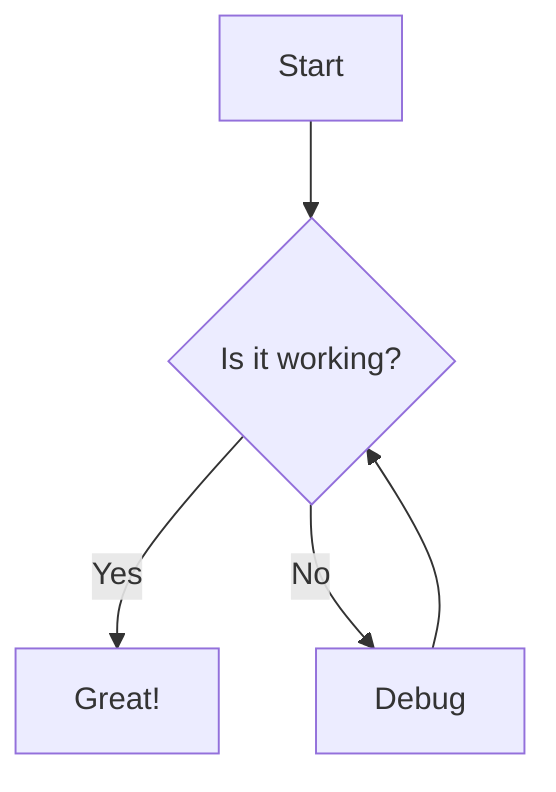
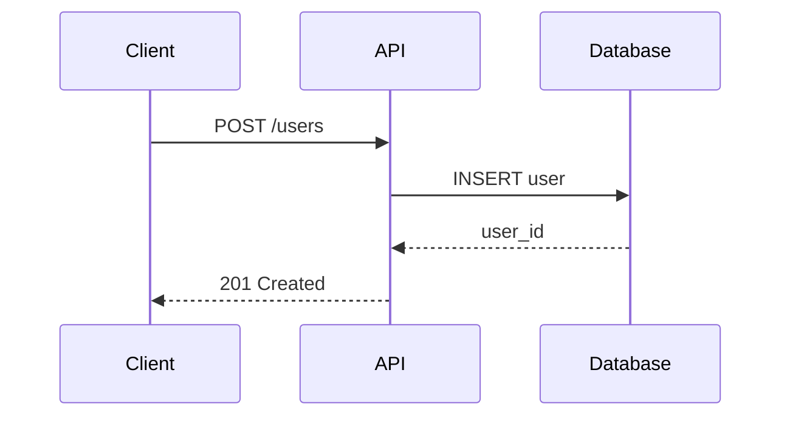
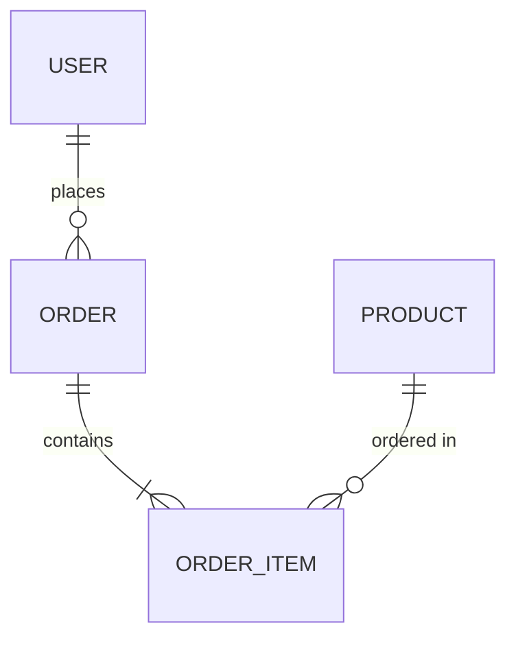

# Markdown Style Guide

> [Doctrine](../../README.md) > [Documentation](../README.md) > Markdown

The key words "MUST", "MUST NOT", "REQUIRED", "SHALL", "SHALL NOT", "SHOULD",
"SHOULD NOT", "RECOMMENDED", "MAY", and "OPTIONAL" in this document are to be
interpreted as described in [RFC 2119](https://datatracker.ietf.org/doc/html/rfc2119).

Extends [Google Markdown Style Guide](google/markdown.md).

## Quick Reference

| Task       | Tool                    | Command                            |
| ---------- | ----------------------- | ---------------------------------- |
| Lint       | markdownlint[^1]        | `npx markdownlint '**/*.md'`       |
| Format     | Prettier[^2]            | `npx prettier --write '**/*.md'`   |
| Diagrams   | Mermaid[^3]             | via markdown code blocks           |
| Link check | markdown-link-check[^4] | `npx markdown-link-check *.md`     |

## Linting: markdownlint

Projects **MUST** use markdownlint[^1] to enforce consistent Markdown style.

```bash
npm install --save-dev markdownlint-cli
npx markdownlint '**/*.md'
```

### Why markdownlint

markdownlint[^1] provides automated enforcement of Markdown conventions, catching
common issues like inconsistent heading styles, improper list formatting, and
missing blank lines. It ensures consistent style across teams without manual
review effort.

### Configuration (.markdownlint.json)

Projects **MUST** use the following base configuration:

```json
{
  "default": true,
  "MD013": false,
  "MD033": false,
  "MD041": false
}
```

Disabled rules:

- `MD013`: Line length (Prettier[^2] handles this)
- `MD033`: Inline HTML (sometimes needed)
- `MD041`: First line must be heading (not always applicable)

## Formatting: Prettier

Projects **MUST** use Prettier[^2] for Markdown formatting with the following
configuration:

```json
{
  "proseWrap": "always",
  "printWidth": 80,
  "tabWidth": 4
}
```

### Why Prettier

Prettier[^2] eliminates debates about formatting details by automatically enforcing
a consistent style. It handles line wrapping, spacing, and alignment
automatically, allowing authors to focus on content rather than formatting.

## Key Conventions

### Line Length

Prose **MUST** wrap at **80 characters**. URLs, code blocks, and tables **MAY**
exceed this limit when necessary.

### Headings

```markdown
# Document Title (only one H1)

## Section

### Subsection
```

Headings **MUST**:

- Use ATX-style (`#`) not Setext-style (underlines)
- Have one blank line before and after
- Omit trailing punctuation

### Lists

```markdown
- Item one
- Item two
    - Nested item (4-space indent)
    - Another nested item
- Item three

1. First step
2. Second step
3. Third step
```

### Code Blocks

Code blocks **MUST** specify the language:

````markdown
```python
def hello():
    print("Hello, World!")
```

```bash
echo "Hello"
```
````

Inline code **SHOULD** be used for: `variable_name`, `function()`, `ClassName`

### Links

```markdown
[Link text](https://example.com)

[Reference-style link][ref]

[ref]: https://example.com
```

### Tables

```markdown
| Header 1 | Header 2 | Header 3 |
|----------|----------|----------|
| Cell 1   | Cell 2   | Cell 3   |
| Cell 4   | Cell 5   | Cell 6   |
```

## Diagrams: Mermaid

Projects **SHOULD** use Mermaid[^3] for diagrams in documentation. It renders in
GitHub, GitLab, and most documentation systems.

### Why Mermaid

Mermaid[^3] diagrams are version-controllable text files, making them easy to
review, diff, and maintain. They render automatically in most modern platforms
without requiring external image hosting or build steps. Changes to diagrams
appear in pull request diffs alongside code changes.

### When to Use Mermaid

- Flowcharts and process diagrams
- Sequence diagrams
- Entity-relationship diagrams
- State diagrams
- Architecture diagrams
- Git graphs

### When NOT to Use Mermaid

Projects **SHOULD NOT** use Mermaid[^3] for:

- Complex diagrams with many nodes (>20)
- Diagrams requiring precise positioning
- Diagrams with images/icons
- Highly customized styling

For complex diagrams, projects **MAY** use dedicated tools (Excalidraw[^5], draw.io[^6])
and embed as images.

### Flowchart

````markdown

````

### Sequence Diagram

````markdown

````

### Entity Relationship

````markdown

````

### Validating Mermaid

```bash
# Install mermaid-cli
npm install -g @mermaid-js/mermaid-cli

# Validate syntax
mmdc -i diagram.mmd -o diagram.png

# Or use online editor
# https://mermaid.live
```

See the Mermaid Live Editor[^7] for interactive diagram creation and validation.

## ASCII Diagrams

For simple diagrams that **MUST** work everywhere (including plain text
viewers), projects **MAY** use ASCII art:

```text
┌─────────────┐     ┌─────────────┐
│   Client    │────>│    API      │
└─────────────┘     └──────┬──────┘
                           │
                           v
                    ┌─────────────┐
                    │  Database   │
                    └─────────────┘
```

### ASCII Box Drawing Characters

```text
Box drawing:
┌ ┐ └ ┘ ─ │ ├ ┤ ┬ ┴ ┼

Arrows:
-> <- ^ v > < A V

Double lines:
╔ ╗ ╚ ╝ ═ ║ ╠ ╣ ╦ ╩ ╬
```

### Checking ASCII Alignment

Ensure your editor uses a monospace font. In CI, you can validate alignment
using a simple script that checks character positions, but this is rarely
necessary if you use proper editor support.

## Link Checking

Projects **SHOULD** validate links using markdown-link-check[^4]:

```bash
npm install --save-dev markdown-link-check
npx markdown-link-check README.md
```

### Why Link Checking

Broken links degrade documentation quality and user trust. Automated link
checking catches broken references before they reach users, especially
important for documentation that references external resources that may change
or move.

### Configuration (.markdown-link-check.json)

```json
{
  "ignorePatterns": [
    { "pattern": "^https://localhost" }
  ],
  "timeout": "20s",
  "retryOn429": true
}
```

## Pre-commit Configuration

Projects **SHOULD** configure pre-commit hooks to run markdownlint[^1] and Prettier[^2]:

```yaml
repos:
  - repo: https://github.com/igorshubovych/markdownlint-cli
    rev: v0.46.0
    hooks:
      - id: markdownlint
        args: [--disable, MD013, MD033, MD041, --]

  - repo: https://github.com/pre-commit/mirrors-prettier
    rev: v4.0.0-alpha.8
    hooks:
      - id: prettier
        types: [markdown]
```

See pre-commit[^8] documentation for more information on configuring hooks.

## CI Pipeline

Projects **SHOULD** run Markdown linting and link checking in CI:

```yaml
jobs:
  lint:
    runs-on: ubuntu-latest
    steps:
      - uses: actions/checkout@v4
      - uses: DavidAnson/markdownlint-cli2-action@v18
      - uses: gaurav-nelson/github-action-markdown-link-check@v1
```

See GitHub Actions[^9] documentation for more CI/CD configuration options.

## See Also

- [Google Markdown Style Guide](google/markdown.md) - Base style guide
- [EditorConfig](editorconfig.md) - Editor configuration for consistent formatting
- [CI/CD Guidelines](../ci.md) - Continuous integration setup
- [Documentation Standards](../README.md) - Overall documentation practices
- CommonMark[^10] - Markdown specification
- GitHub Flavored Markdown[^11] - Extended Markdown syntax

## References

[^1]: [markdownlint](https://github.com/DavidAnson/markdownlint) - A Node.js style checker and lint tool for Markdown/CommonMark files

[^2]: [Prettier](https://prettier.io/) - An opinionated code formatter with support for Markdown

[^3]: [Mermaid](https://mermaid.js.org/) - JavaScript-based diagramming and charting tool that renders Markdown-inspired text definitions

[^4]: [markdown-link-check](https://github.com/tcort/markdown-link-check) - Checks all hyperlinks in Markdown files for validity

[^5]: [Excalidraw](https://excalidraw.com/) - Virtual whiteboard for sketching hand-drawn like diagrams

[^6]: [draw.io](https://www.drawio.com/) - Free online diagram software for making flowcharts, process diagrams, and more

[^7]: [Mermaid Live Editor](https://mermaid.live/) - Interactive editor for creating and validating Mermaid diagrams

[^8]: [pre-commit](https://pre-commit.com/) - A framework for managing and maintaining multi-language pre-commit hooks

[^9]: [GitHub Actions](https://docs.github.com/en/actions) - Automation platform for CI/CD workflows

[^10]: [CommonMark](https://commonmark.org/) - A strongly defined, highly compatible specification of Markdown

[^11]: [GitHub Flavored Markdown](https://github.github.com/gfm/) - GitHub's extended Markdown syntax specification
