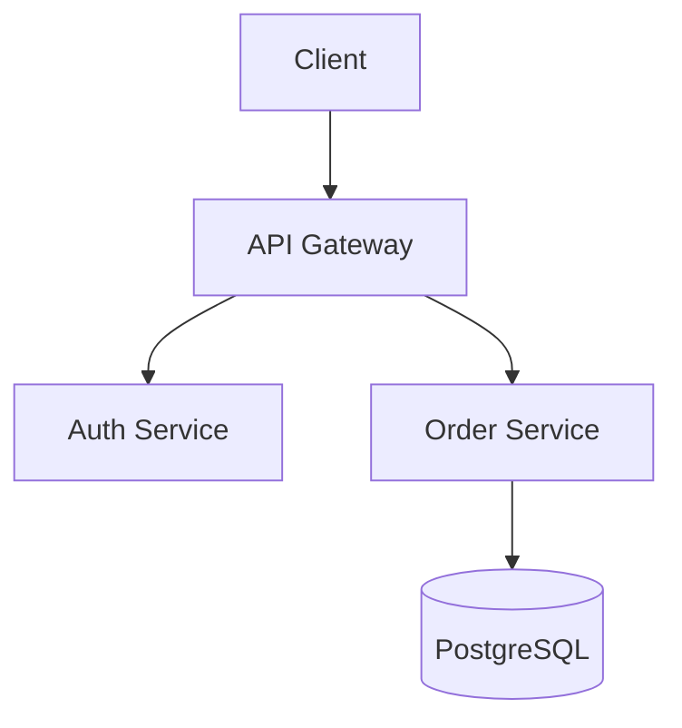

# Specification Writing Guide

> [Doctrine](../../README.md) > [Documentation](README.md) > Specifications

The Spec for Specs: Engineering Documentation in the AI Era.

The key words "MUST", "MUST NOT", "REQUIRED", "SHALL", "SHALL NOT",
"SHOULD", "SHOULD NOT", "RECOMMENDED", "MAY", and "OPTIONAL" in this
document are to be interpreted as described in [RFC 2119](https://datatracker.ietf.org/doc/html/rfc2119).

---

## Table of Contents

1. [Philosophy](#philosophy)
2. [Document Types](#document-types)
3. [The Modern Specification Stack](#the-modern-specification-stack)
4. [Writing for Humans and AI](#writing-for-humans-and-ai)
5. [Big Tech Patterns](#big-tech-patterns)
6. [Document Formats](#document-formats)
7. [Architecture Documentation](#architecture-documentation)
8. [AI-Era Documentation](#ai-era-documentation)
9. [Tooling and Automation](#tooling-and-automation)
10. [Anti-Patterns](#anti-patterns)
11. [Templates](#templates)
12. [References](#references)

---

## Philosophy

### The Documentation Paradox

Documentation has two audiences in 2025: **humans** who make decisions and
**AI agents** who execute work. The best specifications serve both without
compromise.

### Core Principles

#### 1. Narrative Over Bullets

> "PowerPoint is a sales tool. Internally, the last thing you want to do is
> sell. You're truth-seeking." -- Jeff Bezos

Full sentences force clarity of thought. Bullet points hide fuzzy thinking.
Write narratively, then extract summaries for quick reference.

#### 2. Docs as Code

Specifications **MUST** live alongside code in version control. They are
first-class artifacts, reviewed in PRs, validated in CI, and deployed
with releases.

#### 3. Single Source of Truth

Each fact exists in exactly one place. Other documents link, never duplicate.
When information changes, it changes once.

#### 4. Write for Change

Good specs anticipate evolution. Use ADRs to capture decisions. Version specs
alongside code. Make deprecation explicit.

#### 5. AI-Native by Default

Modern specs are consumed by LLMs, AI coding assistants, and autonomous agents.
Structure content for machine parsing without sacrificing human readability.

---

## Document Types

Every engineering organization needs these document types. Each serves a distinct purpose:

| Document           | Purpose                        | Audience         | Lifespan          |
| ------------------ | ------------------------------ | ---------------- | ----------------- |
| **RFC**            | Propose significant changes    | Team/Org         | Until decided     |
| **Design Doc**     | Detail implementation approach | Engineers        | Project duration  |
| **ADR**            | Record architectural decisions | Future team      | Permanent         |
| **PRD**            | Define product requirements    | Cross-functional | Feature lifecycle |
| **PR/FAQ**         | Validate customer value        | Leadership       | Until launch      |
| **Technical Spec** | Define system contracts        | Engineers        | System lifetime   |
| **Runbook**        | Operational procedures         | SREs/Operators   | Continuous        |

### When to Use Each

```text
┌─────────────────────────────────────────────────────────────────┐
│                     DECISION TREE                               │
├─────────────────────────────────────────────────────────────────┤
│                                                                  │
│  "I need to propose a significant change"                        │
│      └──▶ RFC (Request for Comments)                            │
│                                                                  │
│  "I need to explain how we'll build something"                   │
│      └──▶ Design Doc                                            │
│                                                                  │
│  "I need to record why we chose approach X over Y"               │
│      └──▶ ADR (Architecture Decision Record)                    │
│                                                                  │
│  "I need to define what the product should do"                   │
│      └──▶ PRD (Product Requirements Document)                   │
│                                                                  │
│  "I need to validate customer value before building"             │
│      └──▶ PR/FAQ (Amazon Working Backwards)                     │
│                                                                  │
│  "I need to define contracts between systems"                    │
│      └──▶ Technical Spec / API Spec                             │
│                                                                  │
│  "I need to document how to operate something"                   │
│      └──▶ Runbook                                               │
│                                                                  │
└─────────────────────────────────────────────────────────────────┘
```

---

## The Modern Specification Stack

### Tier 1: Strategic (Why)

**PR/FAQ** -- Working Backwards from the customer

- Written before any engineering work begins
- Forces customer-centric thinking
- Kills bad ideas cheaply (words are cheaper than code)

**PRD** -- Product Requirements

- Defines the "what" without the "how"
- Owned by Product Management
- Versioned with major releases

### Tier 2: Tactical (What/How)

**RFC** -- Request for Comments

- Proposes significant changes requiring consensus
- Time-boxed discussion period
- Results in accept/reject/modify decision

**Design Doc** -- Implementation Blueprint

- Details the "how" for a specific project
- Living document during development
- Archived after completion

### Tier 3: Operational (Record)

**ADR** -- Architecture Decision Records

- Captures decisions and context permanently
- Never deleted, only superseded
- Enables future archaeology

**Technical Specs** -- System Contracts

- API specifications (OpenAPI, GraphQL SDL)
- Data schemas (JSON Schema, Protobuf)
- Interface definitions

### Tier 4: Execution (Do)

**Runbooks** -- Operational Procedures

- Step-by-step incident response
- Deployment procedures
- Maintenance tasks

---

## Writing for Humans and AI

### The Dual-Audience Challenge

In 2025, your specifications will be read by:

- **Engineers** making implementation decisions
- **Product managers** understanding scope
- **AI coding assistants** (Cursor, Copilot, Claude Code)
- **AI agents** executing autonomous tasks
- **RAG systems** answering questions about your product

### Structure for Both

**MUST** follow these structural patterns:

```markdown
# Title (H1 - exactly one per document)

## Section (H2 - major logical divisions)

### Subsection (H3 - detailed breakdowns)

Narrative paragraphs for complex explanations. Full sentences
force complete thoughts. Each paragraph addresses one concept.

**Bold key terms** on first use. Use `code formatting` for
technical identifiers, commands, and literals.

| Tables | For | Structured | Data |
|--------|-----|------------|------|
| Row 1  | ... | ...        | ...  |
```

### Semantic Chunking

AI systems chunk documents for embedding and retrieval. **MUST** structure for clean chunking:

```markdown
## Feature: User Authentication          ← Clear topic boundary

### Overview                              ← Standalone summary
Brief description that makes sense in isolation.

### Requirements                          ← Distinct chunk
1. Requirement with full context
2. Self-contained requirement

### Implementation Notes                  ← Separate concern
Technical details grouped together.
```

**Anti-pattern:**

```markdown
## Feature
See above for context...                  ← Lost when chunked
As mentioned in the introduction...       ← Broken reference
```

### Machine-Readable Frontmatter

Every specification **SHOULD** include YAML frontmatter:

```yaml
---
title: "User Authentication System"
type: design-doc                    # rfc | adr | design-doc | prd | spec
status: approved                    # draft | review | approved | superseded
authors:
  - name: Jane Smith
    email: jane@example.com
created: 2025-01-15
updated: 2025-03-20
supersedes: ADR-0042
related:
  - RFC-0089
  - ADR-0051
tags:
  - authentication
  - security
  - api
---
```

---

## Big Tech Patterns

### Google: Design Docs

Google's design doc culture emphasizes informal but rigorous documentation[^1].

**Structure:**

1. **Context and Scope** — Problem definition and boundaries
2. **Goals and Non-Goals** — Explicit inclusions/exclusions
3. **Design** — The proposed solution
4. **Alternatives Considered** — Options evaluated and rejected
5. **Cross-cutting Concerns** — Security, privacy, scalability

**Key Practice:** Design docs are created in collaborative editors (Google Docs),
not wikis. Comments and suggestions are inline, fostering discussion.

**Duration:** Days to weeks of iteration before coding begins.

### Amazon: 6-Pagers and PR/FAQ

Amazon banned PowerPoint in favor of narrative documents[^2].

**6-Pager Structure:**

- 2 pages: General background
- 2 pages: Specific background
- 2 pages: Action and plan

**PR/FAQ Structure:**

- Press Release (< 1 page): Customer announcement
- FAQ (< 5 pages): Internal and external questions

**Key Practice:** Meetings begin with 20-30 minutes of silent reading. Discussion follows shared understanding.

**Philosophy:** "The fact that most PR/FAQs don't get approved is a feature, not a bug."

### Stripe: Writing Culture

Stripe elevates writing to a core engineering skill[^3].

**Key Practices:**

- Sample docs (not templates) provide context, not fill-in-the-blanks
- Engineers review writing like they review code
- Documentation included in engineering career ladder
- API review is a formal, rigorous process

**Philosophy:** "Sharing ideas through writing eliminates the need for repetitive verbal updates."

### Meta: Move Fast with Docs

Meta combines high velocity with documentation discipline[^4].

**Key Practices:**

- Internal Phabricator for code review includes doc review
- Workplace serves as wiki + communication + social
- Strong emphasis on ADRs for knowledge preservation across team changes

### Microsoft: Well-Architected Framework

Microsoft formalizes documentation into frameworks[^5].

**Key Artifacts:**

- Functional Specification: What and why (not how)
- Technical Specification: How (for engineering)
- Architecture Design Specification: Decisions and diagrams

---

## Document Formats

### RFC Format

```markdown
---
type: rfc
rfc: "RFC-0123"
title: "Implement Event Sourcing for Order Service"
status: draft
authors: ["Jane Smith <jane@example.com>"]
created: 2025-01-15
---

# RFC-0123: Implement Event Sourcing for Order Service

## Summary

One paragraph explaining the proposal at a high level.

## Motivation

Why are we doing this? What problems does it solve?
What is the expected outcome?

## Detailed Design

Technical details of the proposal. Include:
- Architecture diagrams
- API changes
- Data model changes
- Migration strategy

## Alternatives Considered

### Alternative A: Continue with CRUD

Rejected because...

### Alternative B: Use Kafka Streams

Rejected because...

## Risks and Mitigations

| Risk | Impact | Likelihood | Mitigation |
|------|--------|------------|------------|
| Data migration failure | High | Medium | Rollback plan |

## Open Questions

- [ ] How will we handle schema evolution?
- [ ] What is the retention policy?

## References

- [Event Sourcing Pattern](https://martinfowler.com/eaaDev/EventSourcing.html)
```

### ADR Format

Based on Michael Nygard's format[^6]:

```markdown
---
type: adr
adr: "ADR-0042"
title: "Use PostgreSQL for Primary Database"
status: accepted
date: 2025-01-15
deciders: ["Jane Smith", "John Doe"]
---

# ADR-0042: Use PostgreSQL for Primary Database

## Status

Accepted

## Context

We need to choose a primary database for the new order service.
The system must handle 10,000 transactions per second with
ACID guarantees. We have existing PostgreSQL expertise.

## Decision

We will use PostgreSQL 16 as the primary database.

## Consequences

### Positive
- Leverages existing team expertise
- Strong ACID compliance
- Excellent tooling ecosystem

### Negative
- Horizontal scaling requires additional architecture
- License considerations for enterprise features

### Neutral
- Requires infrastructure provisioning

## Alternatives Considered

### MySQL 8
Rejected: Weaker JSON support, team has less experience.

### MongoDB
Rejected: ACID requirements favor relational model.
```

### Design Doc Format

```markdown
---
type: design-doc
title: "Payment Processing Redesign"
status: approved
authors: ["Jane Smith"]
reviewers: ["John Doe", "Alice Johnson"]
created: 2025-01-15
approved: 2025-01-22
---

# Payment Processing Redesign

## Overview

One paragraph summary for executives and future readers.

## Context and Scope

### Background

What led to this design? What's the current state?

### Goals

- **G1:** Process payments in < 100ms p99
- **G2:** Support 3 new payment providers

### Non-Goals

- **NG1:** Mobile app changes (separate project)
- **NG2:** Cryptocurrency support

## Design

### System Architecture

```text
┌─────────────┐     ┌──────────────┐     ┌─────────────┐
│   Client    │────▶│  API Gateway │────▶│   Payment   │
└─────────────┘     └──────────────┘     │   Service   │
                                         └──────┬──────┘
                                                │
                    ┌───────────────────────────┼───────────┐
                    ▼                           ▼           ▼
              ┌──────────┐              ┌──────────┐  ┌──────────┐
              │  Stripe  │              │  PayPal  │  │  Square  │
              └──────────┘              └──────────┘  └──────────┘

```

### API Changes

```typescript
// New endpoint
POST /v2/payments
{
  "amount": 1000,
  "currency": "USD",
  "provider": "stripe",
  "idempotency_key": "uuid-v4"
}
```

### Data Model

```sql
CREATE TABLE payments (
    id UUID PRIMARY KEY,
    amount BIGINT NOT NULL,
    currency VARCHAR(3) NOT NULL,
    provider VARCHAR(50) NOT NULL,
    status payment_status NOT NULL,
    created_at TIMESTAMPTZ DEFAULT NOW()
);
```

## Alternatives Considered

### Option A: Extend Existing System

Rejected because...

### Option B: Third-Party Orchestration

Rejected because...

## Security Considerations

- PCI DSS compliance requirements
- Token storage strategy
- Audit logging

## Testing Strategy

- Unit tests for business logic
- Integration tests with provider sandboxes
- Load testing for p99 targets

## Rollout Plan

1. **Week 1:** Deploy to staging
2. **Week 2:** Canary (1% traffic)
3. **Week 3:** Gradual rollout (10% → 50% → 100%)

## Open Questions

- [ ] Retry strategy for failed webhooks?

```text

```

### PR/FAQ Format (Amazon Working Backwards)

```markdown
---
type: prfaq
title: "Automated Deployment Pipeline"
status: draft
author: "Jane Smith"
created: 2025-01-15
---

# Automated Deployment Pipeline

## Press Release

**FOR IMMEDIATE RELEASE**

**ACME Corp Launches Zero-Touch Deployment Pipeline**

*Engineers deploy to production in minutes, not days*

SEATTLE — January 15, 2025 — ACME Corp today announced the launch
of its new Automated Deployment Pipeline, enabling engineering
teams to deploy code changes to production in under 10 minutes
with zero manual intervention.

"Our engineers were spending 40% of their time on deployment
coordination," said Jane Smith, VP of Engineering. "Now they
spend that time building features customers love."

The new pipeline includes automated testing, security scanning,
canary deployments, and one-click rollback. Early adopters
report a 75% reduction in deployment-related incidents.

To learn more, visit docs.acme.com/deployments.

## Frequently Asked Questions

### External FAQ

**Q: How long does a deployment take?**
A: From merge to production, typically 8-12 minutes including
all automated checks.

**Q: What if something goes wrong?**
A: One-click rollback returns to the previous version in under
60 seconds. Automatic rollback triggers on error rate spikes.

### Internal FAQ

**Q: What's the estimated development cost?**
A: 3 engineers for 6 months, approximately $600K fully loaded.

**Q: What are the main technical risks?**
A: Integration with legacy deployment systems. Mitigation:
parallel operation for 3 months.

**Q: Why now?**
A: Deployment incidents increased 40% YoY. Current manual
process doesn't scale with team growth.

**Q: What won't this solve?**
A: Database migrations remain manual. Test flakiness is
a separate initiative.
```

---

## Architecture Documentation

### C4 Model

The C4 Model provides four levels of abstraction[^7]:

```text
Level 1: System Context    — How system fits in the world
Level 2: Container         — High-level technology choices
Level 3: Component         — Components within containers
Level 4: Code              — Implementation details (optional)
```

**SHOULD** include at minimum Levels 1 and 2 for every system.

### Diagrams as Code

**MUST** use text-based diagramming for version control:

**Mermaid** (GitHub/GitLab native):



**PlantUML** (more expressive):

```plantuml
@startuml
!include https://raw.githubusercontent.com/plantuml-stdlib/C4-PlantUML/master/C4_Container.puml

Person(user, "User", "A customer")
System_Boundary(system, "E-Commerce") {
    Container(web, "Web App", "React", "Customer UI")
    Container(api, "API", "FastAPI", "Business logic")
    ContainerDb(db, "Database", "PostgreSQL", "Stores orders")
}
Rel(user, web, "Uses", "HTTPS")
Rel(web, api, "Calls", "JSON/HTTPS")
Rel(api, db, "Reads/Writes", "SQL")
@enduml
```

### arc42 Template

For comprehensive architecture documentation, **SHOULD** follow arc42[^8]:

1. Introduction and Goals
2. Constraints
3. Context and Scope
4. Solution Strategy
5. Building Block View
6. Runtime View
7. Deployment View
8. Crosscutting Concepts
9. Architectural Decisions
10. Quality Requirements
11. Risks and Technical Debt
12. Glossary

---

## AI-Era Documentation

### llms.txt

The llms.txt standard enables LLMs to efficiently consume documentation[^9].

**SHOULD** provide `/llms.txt` at documentation root:

```markdown
# ACME Platform

> Enterprise platform for widget management

## Docs

- [Getting Started](https://docs.acme.com/getting-started.md): Quick start guide
- [API Reference](https://docs.acme.com/api/): Complete API documentation
- [Authentication](https://docs.acme.com/auth.md): OAuth 2.0 integration

## Optional

- [Examples](https://docs.acme.com/examples/): Code samples
- [Changelog](https://docs.acme.com/changelog.md): Version history
```

**SHOULD** also provide `/llms-full.txt` with complete documentation concatenated.

### Model Context Protocol (MCP)

MCP enables AI agents to retrieve structured context[^10]. Teams **SHOULD**
design APIs and documentation with MCP compatibility:

```json
{
  "schema": "mcp/1.0",
  "resources": [
    {
      "type": "documentation",
      "uri": "docs://acme/api/users",
      "content_type": "text/markdown"
    }
  ]
}
```

### Structured for Retrieval

**MUST** optimize for RAG (Retrieval-Augmented Generation):

1. **Self-contained sections** — Each H2 makes sense in isolation
2. **Explicit definitions** — Define terms where used
3. **Consistent formatting** — Predictable patterns aid parsing
4. **Code in fenced blocks** — Always specify language
5. **Tables for structured data** — Easier to parse than prose

### AI-Assisted Writing

LLMs can assist documentation workflows[^11]:

| Task              | AI Contribution        | Human Review |
| ----------------- | ---------------------- | ------------ |
| First drafts      | Generate from specs    | Required     |
| Changelog entries | Generate from commits  | Required     |
| API docs          | Generate from OpenAPI  | Required     |
| Translation       | Translate content      | Required     |
| Proofreading      | Grammar, clarity       | Recommended  |

**MUST NOT** publish AI-generated content without human review.

---

## Tooling and Automation

### Docs as Code Pipeline

```yaml
# .github/workflows/docs.yml
name: Documentation
on:
  push:
    paths: ['docs/**', '*.md']

jobs:
  validate:
    runs-on: ubuntu-latest
    steps:
      - uses: actions/checkout@v4

      # Lint markdown
      - run: npx markdownlint-cli2 "**/*.md"

      # Check links
      - run: npx markdown-link-check docs/**/*.md

      # Validate frontmatter
      - run: npx front-matter-lint docs/**/*.md

      # Generate diagrams
      - run: npx @mermaid-js/mermaid-cli docs/**/*.md -o docs/

      # Build site
      - run: npx mintlify build
```

### Recommended Tools

| Category | Tool                 | Purpose               |
| -------- | -------------------- | --------------------- |
| Linting  | markdownlint         | Markdown style        |
| Links    | markdown-link-check  | Broken link detection |
| Diagrams | Mermaid, PlantUML    | Diagrams as code      |
| Site     | Mintlify, Docusaurus | Documentation sites   |
| API Docs | OpenAPI, AsyncAPI    | API specifications    |
| ADRs     | adr-tools            | ADR management        |
| Search   | Algolia DocSearch    | Documentation search  |

### ADR Tooling

Install adr-tools[^12]:

```bash
# macOS
brew install adr-tools

# Create new ADR
adr new "Use PostgreSQL for primary database"

# Supersede existing ADR
adr new -s 42 "Switch to CockroachDB"
```

---

## Anti-Patterns

### 1. The Dead Doc

**Problem:** Documentation written once, never updated.

**Solution:**

- Link docs to code in CI (fail if out of sync)
- Review docs in PRs that change related code
- Add expiration dates or review reminders

### 2. The Wiki Wasteland

**Problem:** Documentation scattered across wikis, losing version history.

**Solution:**

- Docs live in code repositories
- Single source of truth per topic
- Wiki only for ephemeral/operational content

### 3. The Template Trap

**Problem:** Empty templates filled with placeholder text.

**Solution:**

- Use sample docs, not blank templates
- Delete sections that don't apply
- Require narrative over checkboxes

### 4. The Specification Novel

**Problem:** 50-page specs no one reads.

**Solution:**

- Executive summary in first paragraph
- Link to details, don't inline everything
- Time-box reading: if it takes > 30 minutes, split it

### 5. The Orphaned Decision

**Problem:** Decisions made in Slack, lost forever.

**Solution:**

- Formal ADR process for architectural decisions
- Bot to prompt "Should this be an ADR?"
- Quarterly ADR audits

### 6. The Human-Only Doc

**Problem:** Documentation AI assistants can't parse.

**Solution:**

- Structured frontmatter
- Consistent heading hierarchy
- Self-contained sections
- Machine-readable formats (OpenAPI, JSON Schema)

---

## Templates

### Quick Reference

Copy the appropriate template and customize:

| Template   | Path                                                                     | Use Case                |
| ---------- | ------------------------------------------------------------------------ | ----------------------- |
| RFC        | [templates/rfc.md](#rfc-format)                                          | Proposing changes       |
| ADR        | [templates/adr.md](#adr-format)                                          | Recording decisions     |
| Design Doc | [templates/design-doc.md](#design-doc-format)                            | Implementation planning |
| PR/FAQ     | [templates/prfaq.md](#prfaq-format-amazon-working-backwards)             | Customer validation     |

### Minimal Spec (Quick Start)

For smaller changes, use this minimal format:

```markdown
---
title: "Feature Name"
type: spec
status: draft
author: "Your Name"
date: 2025-01-15
---

# Feature Name

## Summary

One paragraph: what, why, and for whom.

## Requirements

1. **Functional:** What it must do
2. **Non-functional:** Performance, security constraints

## Design

How it works. Include diagrams if helpful.

## Risks

What could go wrong and how we mitigate.

## Questions

- [ ] Open questions to resolve
```

---

## Success Metrics

### Documentation Quality (DORA)

The 2024 DORA Report confirms documentation directly impacts team performance[^13]:

| Metric                 | Poor Docs | Good Docs | Impact    |
| ---------------------- | --------- | --------- | --------- |
| Onboarding time        | Weeks     | Days      | 3x faster |
| Deployment frequency   | Monthly   | Daily     | 30x       |
| Change failure rate    | 45%       | 15%       | 3x better |
| Developer satisfaction | Low       | High      | Retention |

### Leading Indicators

- **Coverage:** % of services with up-to-date specs
- **Freshness:** Days since last update
- **Usage:** Page views, search queries
- **AI Compatibility:** llms.txt present, MCP integration

---

## Summary

Modern specifications serve dual audiences—humans and AI—without compromise. They
live as code, evolve with products, and encode organizational knowledge that
outlasts any individual.

**Key Takeaways:**

1. **Write narratively** — Full sentences force complete thoughts
2. **Structure for both** — Humans scan, AI chunks
3. **Version everything** — Docs in git, reviewed in PRs
4. **Capture decisions** — ADRs create institutional memory
5. **Validate before building** — PR/FAQ kills bad ideas cheaply
6. **Automate quality** — Lint, link-check, validate in CI
7. **Optimize for AI** — llms.txt, MCP, structured content

---

## References

[^1]: [Design Docs at Google](https://www.industrialempathy.com/posts/design-docs-at-google/)
[^2]: [Working Backwards: Amazon PR/FAQ Process](https://workingbackwards.com/concepts/working-backwards-pr-faq-process/)
[^3]: [How Stripe Built a Writing Culture](https://slab.com/blog/stripe-writing-culture/)
[^4]: [Inside Meta's Engineering Culture](https://newsletter.pragmaticengineer.com/p/facebook)
[^5]: [Microsoft Azure Well-Architected Framework](https://learn.microsoft.com/en-us/azure/well-architected/architect-role/architecture-design-specification)
[^6]: [Architecture Decision Records](https://github.com/joelparkerhenderson/architecture-decision-record)
[^7]: [C4 Model](https://c4model.com/)
[^8]: [arc42 Documentation Template](https://arc42.org/)
[^9]: [llms.txt Standard](https://llms-txt.io/)
[^10]: [Model Context Protocol](https://modelcontextprotocol.io/)
[^11]: [AWS Documentation AI Practices](https://aws.amazon.com/blogs/aws-insights/aws-documentation-update-progress-challenges-and-whats-next-for-2025/)
[^12]: [adr-tools](https://github.com/npryce/adr-tools)
[^13]: [2024 DORA Report](https://dora.dev/)

---

## See Also

- [Markdown Guide](markdown.md) — Markdown formatting standards
- [AGENTS.md Patterns](../ai/agents-md.md) — AI assistant context files
- [GitHub Templates](../process/github-templates.md) — Issue and PR templates
- [CI/CD Guide](../process/ci.md) — Automation pipelines
